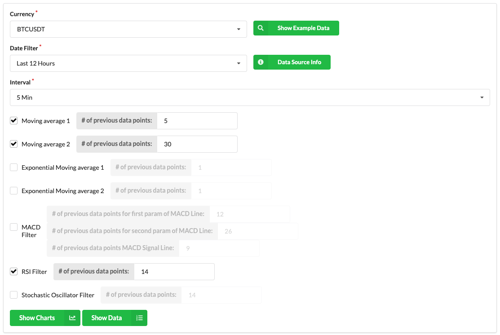

# Ticker Analysis Application for Atlas App Services

## Contents

- [Intro](https://github.com/afsungur/mongodb-ticker-analysis-atlas-app#intro)
- [Pre-Requisites](https://github.com/afsungur/mongodb-ticker-analysis-atlas-app#pre-requisites)
- [Steps to Install Application](https://github.com/afsungur/mongodb-ticker-analysis-atlas-app#steps-to-install-application)
- [Modifying the React Web Application](https://github.com/afsungur/mongodb-ticker-analysis-atlas-app#modifying-react-web-application)

## Intro

This repository includes the complete export of the Atlas App Services Application, Financial Ticker Analysis. Please follow the guideline below to make it ready for use. 

- Time to complete: 30 minutes after an Atlas Cluster has been provisioned

## Pre-Requisites

 - Have a MongoDB Cloud Account -> cloud.mongodb.com
 - Provision a minimum M10 Database Cluster
 - Create the following collections (keep the database and collection names the same otherwise you'll need to change config)
	 - Collection name: `exchange.cryptoTickerCoinbase`
		 ```javascript
		use exchange
		db.createCollection("cryptoTickerCoinbase",
			{
				"timeseries" : {
					"timeField" : "time",
					"metaField" : "symbol",
					"granularity" : "seconds"
				},
				"expireAfterSeconds": 259200 
			}
		)

		db.cryptoTickerCoinbase.createIndex({ symbol: 1, time:1 })
		db.cryptoTickerCoinbase.createIndex({ time:1 })
		 ```

	 - Collection name: `exchange.cryptoTickerBinance`
		 ```javascript
		use exchange
		db.createCollection("cryptoTickerBinance",
			{
				"timeseries" : {
					"timeField" : "time",
					"metaField" : "symbol",
					"granularity" : "seconds"
				},
				"expireAfterSeconds": 259200 
			}
		)

		db.cryptoTickerBinance.createIndex({ symbol: 1, time:1 })
		db.cryptoTickerBinance.createIndex({ time:1 })
		 ```


- Download `realm-cli` utility: https://www.mongodb.com/docs/realm/cli/ 

## Steps to Install Application

 1. Create an App in Atlas App Services
	- Provide a name for your application
	- Choose the Atlas cluster that you want to connect from this application
		- Automatically necessary [Linked Data Source](https://www.mongodb.com/docs/realm/mongodb/link-a-data-source/#:~:text=To%20connect%20to%20a%20data,an%20import/export%20configuration%20directory.) will be created.
	- You can find an example in the below.
		


2. Enable hosting in your Atlas App Services Application
	- Check this out: https://www.mongodb.com/docs/realm/hosting/enable-hosting/ 
	- 

3. Authenticate to the Application via `realm-cli` after you created the API key
	- Check this out: https://www.mongodb.com/docs/realm/reference/cli-auth-with-api-token/
	
 	
4. Verify that you've logged in successfully:
	```bash
		$ realm-cli whoami
		Currently logged in user: qrjaulcs (********-****-****-****-ad082b5d4380)
	```

5. Export this App Services Application into the local directory
	- Get the application id from the user interface
	- And pass it to the utility as shown in the below
	- You will be required to choose the project
	```bash
		$ realm-cli pull --remote tickerapplication-blhjj --include-hosting
		$ cd TickerApplication/
	```
	

	

6. Clone this git repository. And change the current directory to this folder.
	```bash
		cd
		git clone https://github.com/afsungur/mongodb-ticker-analysis-atlas-app.git
		cd mongodb-ticker-analysis-atlas-app
	```
7. Copy the following folders from the cloned repository to the your App Services Application that you pulled into your local drive.
	- Assumed that current directory is the cloned repository and ```../TickerApplication/``` is the folder where you pulled your App Services App into.

	```bash
		$ cp -r app/functions ../TickerApp/
		$ cp -r app/values ../TickerApp/
		$ cp -r app/triggers ../TickerApp/
		$ cp -r app/hosting/files ../TickerApp/hosting/
		$ cp -r app/data_sources/mongodb-atlas/exchange ../TickerApp/data_sources/mongodb-atlas/
		$ cp -r app/auth ../TickerApp/
	```

9. Change the REALM_APP_ID variable value in the ```config.js``` file with your App Services Application id. ```config.js``` file is in the ```hosting/files/``` folder of your application:

	```
		REALM_APP_ID = "tickerapplication-blhjj"
		window['getConfig'] = {
		    "REALM_APP_ID": `${REALM_APP_ID}`
		}
	```

10. Make sure you have the following folder structure after you've completed all the operations above.

	


11. Make sure you are on the root folder of your App Services Application. And then push the local changes into the remote
	- ```$ realm-cli push --include-hosting ```
	- Confirm the changes if it's asked


12. Enable Single Page Application in App Services Hosting. 
	- In order to do that, go to Hosting section of App Services Application. 
		- 
	- Then choose index.html file as SPA file and save it.
		- 


12. Static hosting will not be ready immediately. In the meantime, you can check the collections that needs to be filled with the records by Scheduled Trigger. Check the number of records for the following collections:
	
	```javascript
		use exchange
		db.cryptoTickerBinance.countDocuments()
		db.cryptoTickerCoinbase.countDocuments()

	```

13. After 10-15 minutes, visit the hosting.
	- You should see the Latest Information section data to be filled out in a few seconds. Basically, it runs some queries on the database to fetch some statistics.
	- You should see the Currency combobox to be filled out currencies.
	- Example screenshot:
		- 
	- Try to run some reports:
		- Fill out the form as shown in the below and hit the "Show Charts" button.
			- 
		- You'll see Candlestick and RSI Charts as in the below:
			- 
		- You'll see the Generated Aggregation Query as in the below:
			- 


## Modifying the React Web Application

This repository has static hosting files that includes compiled React Web App. In order to update the React Web Application, please have a look at [the other repository](https://github.com/afsungur/mongodb-ticker-analysis-react-app) that includes source code of the React Web App.

After you've completed your changes for React Web App, built it and upload the built folder accordingly into the App Services Hosting.
